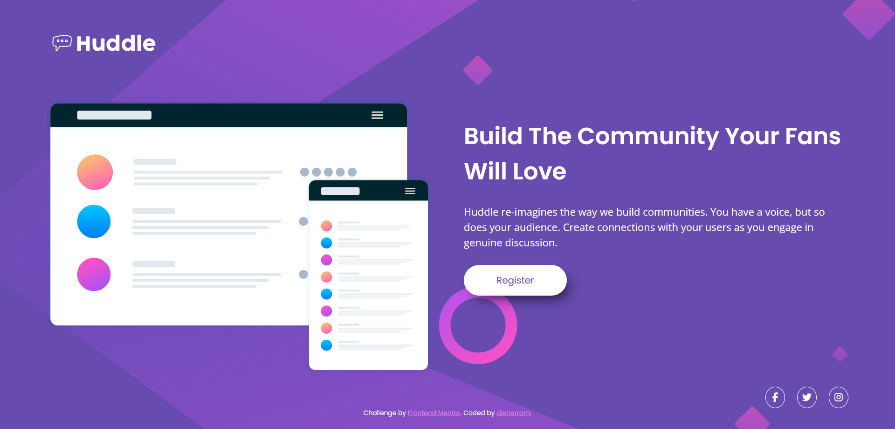

# Huddle Landing Page with Single Introductory Section 🚀

## Visión General 💡

Este proyecto replica la página de inicio de Huddle con una única sección introductoria. El desafío consistió en construir la página según los diseños proporcionados y hacerla responsiva para diferentes dispositivos. Los usuarios deberían poder ver el diseño óptimo según el tamaño de la pantalla de su dispositivo y ver los estados de hover para los elementos interactivos.

## Capturas de Pantalla 🖼️

### Escritorio

### Móvil

### Enlaces 🔗
- [Ver Solución en GitHub Pages](https://dieherram.github.io/fem-huddle-landing-page/)

## Mi Proceso 🛠️

Me enfoqué en organizar la estructura HTML y aplicar estilos usando CSS, utilizando Flexbox para la organización del contenido y Grid para el diseño de los layout.

## Construido Con 🛠️

- HTML5
- CSS
- Flexbox
- Grid

## Lo Que Aprendí 🧠

Este proyecto brindó la oportunidad de fortalecer mis habilidades en la creación de diseños responsivos.

## Desarrollo Continuo 🚧

En términos de diseño y maquetación, seguiré explorando y mejorando el uso de CSS Grid junto con Flexbox. Ambas tecnologías son poderosas y, cuando se combinan, ofrecen un control más granular y versatilidad en la disposición de los elementos en una página web. Este enfoque permitirá un diseño más flexible y dinámico, especialmente en secciones más complejas.

## Autor 👨‍💻

- GitHub: [@dieherram](https://github.com/dieherram)
- Frontend Mentor: [@dieherram](https://www.frontendmentor.io/profile/dieherram)
- Codewars: [@dieherram](https://www.codewars.com/users/dieherram)
- LinkedIn: [Diego Hernández Ramos](https://www.linkedin.com/in/diego-hernandez-ramos/)

## Reconocimientos 🙌

¡Gracias a Frontend Mentor por proporcionar desafíos y a la increíble comunidad de desarrolladores! 🌟
